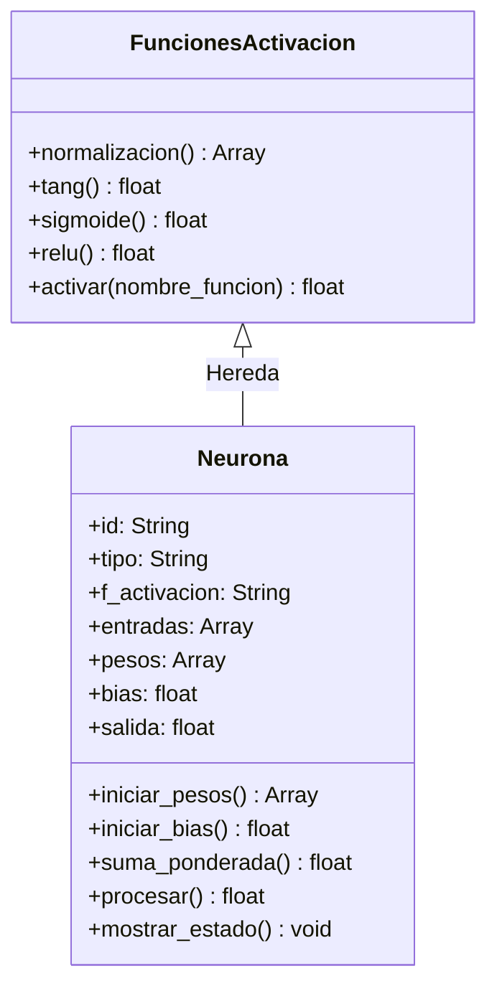
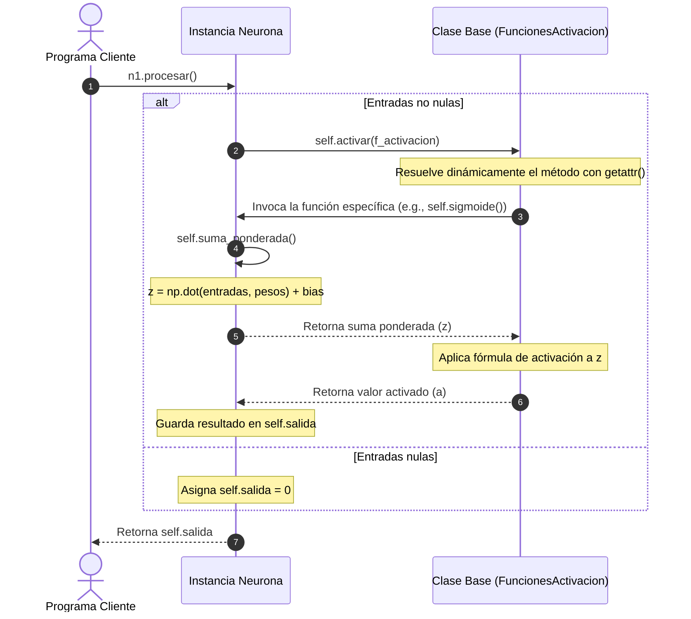

# Arquitectura y Flujo de Procesamiento

Este documento describe la relación estructural de las clases y el orden cronológico en el que se ejecutan los cálculos al procesar entradas en la neurona.

---

## 🏗️ Jerarquía de Clases (Herencia)

El diseño del proyecto utiliza herencia para separar la lógica matemática de activación del estado e inicialización de la neurona:

*Nota: [Neurona](../../neurona.py) hereda directamente de [FuncionesActivacion](../../FunAct.py), permitiéndole invocar métodos como `self.activar()` y acceder a las funciones individuales de activación de manera directa.*

---

## 🔄 Flujo de Procesamiento de una Neurona

Cuando se invoca el método `procesar()` en una instancia de `Neurona`, se inicia una secuencia de llamadas internas estructurada de la siguiente manera:

### Explicación del Ciclo:
1. **Llamada a `procesar()`**: El programa cliente inicializa las entradas y solicita procesar.
2. **Despacho de Activación**: `procesar()` delega en `activar(...)` de la clase base.
3. **Llamada de Vuelta (Callback)**: El método de activación seleccionado (como `sigmoide()`, `tang()`, `relu()`) llama a `self.suma_ponderada()` para obtener la entrada neta combinada.
4. **Cálculo de la Suma Ponderada**: `suma_ponderada()` ejecuta la suma ponderada lineal.
5. **Aplicación de No-Linealidad**: La función de activación aplica su fórmula sobre la suma ponderada.
6. **Guardado e Interconexión**: La neurona almacena su salida activada, lista para ser leída por otras neuronas.
