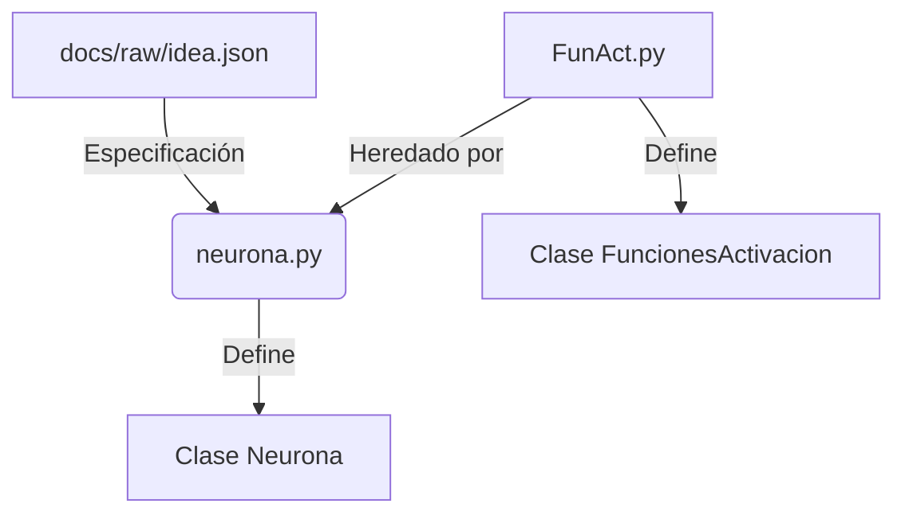

# MOC - Redes Neuronales Artificiales (Práctica)

¡Bienvenido a la bóveda de documentación de **RNA-practica** estructurada bajo el método **LLM Wiki (Karpathy)**! Este espacio documenta el diseño de componentes modulares tipo LEGO para construir redes neuronales artificiales desde cero en Python.

---

## 🗂️ Capas de la Bóveda

### Capa 1: Fuentes Crudas (`docs/raw/`)
- [[idea.json|idea.json (Especificación original)]] (Especificación dinámica para la Neurona Lego).
- [llm-wiki.md](../raw/llm-wiki.md) (Especificación original del Método Karpathy para la Wiki de LLMs).

### Capa 2: Wiki Sintetizada (`docs/wiki/`)
1. 🧩 [[Neurona Lego Base]]: Unidad atómica de procesamiento (`Neurona`). Basado en [idea.json](file:///g:/Mi%20unidad/desarrollo/RNA-practica/docs/raw/idea.json) y desarrollado en [neurona.py](file:///g:/Mi%20unidad/desarrollo/RNA-practica/neurona.py).
2. ⚡ [[Funciones de Activacion]]: Teoría y matemática detrás de las funciones de activación en [FunAct.py](file:///g:/Mi%20unidad/desarrollo/RNA-practica/FunAct.py) (ReLU, Sigmoide, Tanh) y normalización.
3. 🔄 [[Arquitectura y Flujo]]: Explicación del ciclo de procesamiento interno de la neurona (`compute -> activate`).
4. 🗺️ [[Mapa Neuronal.canvas|Mapa Espacial Neuronal (Canvas)]]: Mapa interactivo espacial de los componentes y el flujo lógico de la neurona.

---

## 🏗️ Mapa de Relaciones

---

## 🔧 Integraciones y Automatización
- **Obsidian CLI**: Puedes interactuar con esta bóveda usando comandos como `obsidian search` o automatizar notas mediante `obsidian eval`.
- **Habilidades para Agentes**: Si usas agentes locales de IA (como Claude Code), asegúrate de que carguen las habilidades de [kepano/obsidian-skills](https://github.com/kepano/obsidian-skills) para el parseo correcto de Wikilinks, Canvas y Callouts.
