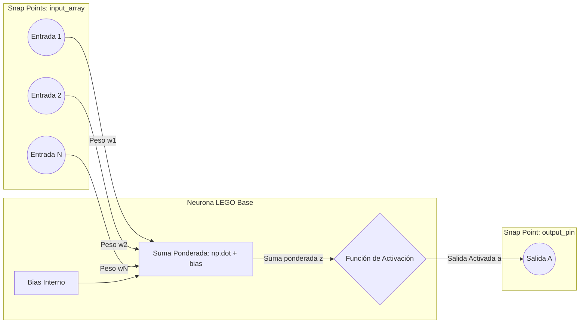

# Neurona Lego Base

La **Neurona Lego Base** es la unidad de procesamiento independiente fundamental (o *atomic unit*) del proyecto. Está diseñada con conectividad dinámica y autogestión de pesos, siguiendo la especificación original definida en [idea.json](../raw/idea.json).

> [!NOTE]
> Su diseño es modular y "pluggable", lo que significa que puede conectarse con otras unidades sin requerir un orquestador central rígido.

---

## 📋 Ficha Técnica (Estructura)

Según la definición del componente, cada neurona consta de los siguientes elementos:

1. **Entradas (`inputs`)**:
   - Mapeo dinámico de conexiones entrantes.
   - En el código actual ([neurona.py](../../neurona.py)), se representa de forma simplificada mediante un arreglo de Numpy (`np.array`) pasado en el constructor.
2. **Estado Interno (`internal_state`)**:
   - **Sesgo (`bias`)**: Inicializado aleatoriamente en el constructor mediante `np.random.random()`.
   - **Pesos (`pesos`)**: Arreglo de la misma longitud que las entradas, inicializado de forma aleatoria con `np.random.rand()`.
   - **Función de Activación (`activation_function`)**: Define cuál de las [[Funciones de Activacion]] se usará (por ejemplo: `relu`, `sigmoide`, o `tang`).
   - **Búfer de Error (`error_buffer`)**: Reservado para almacenar el gradiente local del error ($\delta$) durante el algoritmo de retropropagación.
3. **Salida (`output`)**:
   - Representa el punto de difusión universal del resultado procesado (`self.salida`).

---

## ⚙️ Métodos y Operaciones

La neurona procesa la información de acuerdo con las siguientes etapas:

### 1. Suma Ponderada (`compute`)
Calcula el valor neto combinando las entradas con sus respectivos pesos, más el sesgo de la neurona:

$$z = \sum_{i=1}^{n} (x_i \cdot w_i) + b$$

En [neurona.py](../../neurona.py#L30-L34), se implementa de la siguiente manera:
```python
def suma_ponderada(self):
    if self.entradas is None or self.pesos is None:
        return None
    return np.dot(self.entradas, self.pesos) + self.bias
```

### 2. Activación (`activate`)
Aplica la función de activación seleccionada al resultado de la suma ponderada:

$$a = f(z)$$

En el código, esto se realiza mediante el método `activar` heredado de la clase base [[Funciones de Activacion]].

---

## 🎨 Diagrama de la Neurona Lego

El siguiente diagrama muestra los puntos de encaje (*snap points*) y el flujo desde que entran los datos hasta que se difunde la salida:


